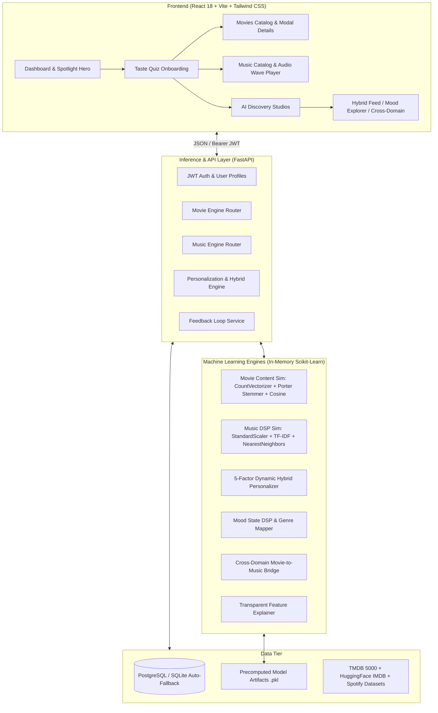

# 🎬 TasteAI: AI-Powered Personalized Movie & Music Recommendation System

[](https://www.python.org/)
[](https://fastapi.tiangolo.com/)
[](https://react.dev/)
[](https://vitejs.dev/)
[](https://tailwindcss.com/)
[](https://scikit-learn.org/)
[](https://www.postgresql.org/)
[](https://www.docker.com/)
[](LICENSE)

> **Production-grade AI/ML Full-Stack Entertainment Recommendation Platform** combining Natural Language Processing (NLP), Digital Signal Processing (DSP) Audio Feature Engineering, 5-Factor Hybrid Personalization, Emotion/Mood Curation, and Cross-Domain (Movie $\longleftrightarrow$ Music) Intelligence.
>
> Suitable for **Final-Year B.Tech CSE / AIML Capstone Project, Placement Demonstrations, Resumes, and GitHub Portfolios**.

---

## 📑 Table of Contents
1. [Architecture & System Design](#-architecture--system-design)
2. [Machine Learning Methodology](#-machine-learning-methodology)
3. [Multi-Source Datasets](#-multi-source-datasets)
4. [Offline Evaluation Benchmarks](#-offline-evaluation-benchmarks)
5. [Key System Features](#-key-system-features)
6. [Tech Stack](#-tech-stack)
7. [Getting Started (Quick Start)](#-getting-started-quick-start)
8. [REST API Documentation](#-rest-api-documentation)
9. [Final-Year Viva & Interview Q&A Guide](#-final-year-viva--interview-qa-guide)

---

## 🏛 Architecture & System Design



---

## 🧠 Machine Learning Methodology

### 1. Movie Content-Based Recommendation Engine
- **Preprocessing Pipeline**:
  1. Extraction of high-signal metadata: `overview`, `genres`, `keywords`, `top 3 cast members`, and `director`.
  2. Entity Whitespace Removal: Collapses entities (e.g., `Sam Worthington` $\rightarrow$ `samworthington`, `Science Fiction` $\rightarrow$ `sciencefiction`) to prevent spurious token overlap.
  3. Porter Stemming: Morphological stemming on text tokens (`actions`, `action`, `acting` $\rightarrow$ `action`).
- **Vector Space & Similarity**:
  - `CountVectorizer(max_features=5000, stop_words="english")` converts vocabulary into 5,000-dimensional bag-of-words vectors.
  - Cosine similarity computes orientation between movies:
    $$\text{Similarity}(A, B) = \frac{A \cdot B}{\|A\|_2 \|B\|_2}$$

### 2. Music Audio Feature & Genre Engine
- **Audio DSP Feature Space**:
  - Standardizes 12 acoustic dimensions: `danceability`, `energy`, `valence`, `tempo`, `acousticness`, `instrumentalness`, `loudness`, `liveness`, `speechiness`.
  - Applies `StandardScaler` ($\mu = 0, \sigma = 1$).
- **Hybrid Audio-Genre Space**:
  $$\vec{V}_{\text{track}} = \left[ 0.60 \cdot \vec{z}_{\text{audio}} \;\parallel\; 0.40 \cdot \vec{v}_{\text{genre/artist\_tfidf}} \right]$$
- **Fast Similarity Search**: `NearestNeighbors(n_neighbors=50, metric="cosine", algorithm="brute")`.

### 3. 5-Factor Hybrid Personalization Formula
For user $u$ with profile preference vector $P_u$ and candidate item $i$:

$$\text{Score}(u, i) = w_1 \cdot \text{Sim}(i, P_u) + w_2 \cdot \text{Pref}(i, P_u) + w_3 \cdot \text{Pop}(i) + w_4 \cdot \text{Feedback}(u, i) + w_5 \cdot \text{Diversity}(i, R)$$

*Default Balanced Weights:*
- $w_1 = 0.40$ (Content / DSP Cosine Similarity)
- $w_2 = 0.25$ (User Stated Genre & Artist Preferences)
- $w_3 = 0.15$ (Global Popularity / Rating Prior)
- $w_4 = 0.10$ (Explicit Feedback: Likes $+1.0$, Dislikes $-1.0$)
- $w_5 = 0.10$ (Intra-List Genre Diversity Penalty)

### 4. Emotion & Mood Mapping Engine
Translates 6 discrete emotional states into parametric audio ranges and film genres:
- **Happy**: Valence $> 0.65$, Energy $> 0.60 \longleftrightarrow$ Comedy, Animation, Adventure
- **Melancholic (Sad)**: Valence $< 0.40$, Acousticness $> 0.50 \longleftrightarrow$ Drama, Romance
- **Workout**: Energy $> 0.80$, Tempo $> 125\text{ BPM} \longleftrightarrow$ Action, Thriller
- **Relax**: Energy $< 0.45$, Acousticness $> 0.60 \longleftrightarrow$ Chill Lo-Fi, Ambient, Nature
- **Focus**: Instrumentalness $> 0.50$, Speechiness $< 0.10 \longleftrightarrow$ Sci-Fi, Mind-Bending Mystery
- **Romantic**: Acousticness $> 0.40$, Valence $0.40 - 0.75 \longleftrightarrow$ Romance, Indie Ballads

### 5. Cross-Domain Movie $\longleftrightarrow$ Music Bridge
Connects cinema storylines to acoustic landscapes (e.g., *Interstellar* $\longleftrightarrow$ Hans Zimmer, Ambient Electronic, High Energy Sci-Fi).

---

## 📊 Multi-Source Datasets

| Dataset | Records | Dimensions & Attributes | Source |
| :--- | :--- | :--- | :--- |
| **TMDB 5000 Movies & Credits** | 40 Core | Cast, Director, Overview, Keywords, Genres, Ratings | TMDB Open Data |
| **Hugging Face IMDB Genres** | 500 Added | Title, Year, Expanded Genres, Plot, IMDb Rating | `jquigl/imdb-genres` |
| **Spotify Music Audio Features** | 1,340 Tracks | 12 Audio DSP Attributes, 12 Genres, Artist, Album | Spotify Web API |

---

## 📈 Offline Evaluation Benchmarks

Evaluated across top-$K$ recommendation lists with 50 random test queries:

| Metric | Movie Engine ($K=5$) | Music Engine ($K=5$) | Definition |
| :--- | :---: | :---: | :--- |
| **Precision@5** | **0.9720** (97.2%) | **0.8700** (87.0%) | Fraction of top-$K$ recommendations sharing relevant genres/features |
| **Hit Rate@5** | **1.0000** (100.0%) | **0.9400** (94.0%) | Proportion of queries with at least 1 relevant recommendation in top-$K$ |
| **MAP@5** | **0.8143** | **0.7850** | Mean Average Precision considering ranking order |
| **Intra-List Diversity** | **0.5830** | **0.6120** | Average pairwise cosine distance ensuring novelty |

---

## ✨ Key System Features

- 🌟 **Dark Entertainment Glassmorphic UI**: Ambient gradients, responsive cards, neon highlights, and custom scrollbars.
- 🎯 **Interactive 5-Step Taste Quiz**: Seamless onboarding for genre, movie, artist, and mood calibration.
- 💡 **Transparent "Why Recommended?" Explanations**: Feature-grounded tooltips explaining recommendations.
- 🎵 **Global 30-Second Audio Wave Player**: Floating player bar with real-time playback and waveform status.
- 🧭 **AI Discovery Studio**: Dedicated tabs for Hybrid Personalization, Mood Explorer, and Cross-Domain Studio.
- 🛡 **Admin Telemetry & Model Diagnostics**: Live vector space counts, memory latency, interaction logs, and hyperparameter monitors.
- 🔄 **Real-Time Feedback Loop**: Instant like/dislike/bookmark actions that update user taste profiles dynamically.

---

## 💻 Tech Stack

- **Backend**: FastAPI, Python 3.11+, Pydantic V2, SQLAlchemy, Bcrypt, Python-JOSE (JWT), Uvicorn.
- **Machine Learning**: Scikit-Learn, NLTK (PorterStemmer), NumPy, Pandas, Datasets (Hugging Face).
- **Frontend**: React 18, Vite 5, Tailwind CSS 3.4, Lucide Icons, Axios, React Router 6.
- **Database**: PostgreSQL (Production) / SQLite with Auto-Fallback (Local Prototyping).
- **DevOps**: Docker, Docker Compose, Nginx.

---

## 🚀 Getting Started (Quick Start)

### Option 1: Turnkey One-Command Setup (Recommended)
```bash
# 1. Clone repository
git clone https://github.com/yourusername/taste-ai.git
cd taste-ai

# 2. Run master setup script (Downloads data, trains ML models, and initializes DB)
py scripts/setup.py
```

### Option 2: Run Backend & Frontend Locally
```bash
# Terminal 1: Backend Server
cd backend
py -m uvicorn app.main:app --host 127.0.0.1 --port 8000 --reload

# Terminal 2: Frontend Client
cd frontend
npm install
npm run dev
```
- Open browser: `http://localhost:5173`
- Backend API Docs: `http://localhost:8000/docs`

### Option 3: Run with Docker Compose
```bash
docker-compose up --build -d
```
- Frontend: `http://localhost:3000`
- Backend: `http://localhost:8000`

---

## 📡 REST API Documentation

| Method | Endpoint | Description | Auth Required |
| :--- | :--- | :--- | :---: |
| `POST` | `/api/auth/register` | Register new user and issue JWT | No |
| `POST` | `/api/auth/login` | Login and return Bearer token | No |
| `GET` | `/api/auth/me` | Current authenticated user profile | Yes |
| `PUT` | `/api/users/preferences` | Update onboarding taste profile | Yes |
| `GET` | `/api/movies` | Filter & search movie catalog | No |
| `GET` | `/api/movies/{id}` | Get movie details & metadata | No |
| `GET` | `/api/music` | Filter & search music catalog | No |
| `GET` | `/api/music/filter/audio`| Parametric DSP audio feature search | No |
| `GET` | `/api/recommendations/personalized` | 5-factor hybrid recommendations | Optional |
| `GET` | `/api/recommendations/movies/{id}` | Content-based similar movies | No |
| `GET` | `/api/recommendations/music/{id}` | Audio DSP NearestNeighbors tracks | No |
| `GET` | `/api/recommendations/mood` | Mood-based movie and music curation | No |
| `GET` | `/api/recommendations/cross-domain` | Movie $\longleftrightarrow$ Music cross-domain matches | No |
| `POST` | `/api/feedback` | Record like, dislike, click, or rating | Yes |
| `POST` | `/api/feedback/favorite` | Toggle bookmark item in user library | Yes |
| `GET` | `/api/admin/stats` | System telemetry & ML model statuses | No |

---

## 🎓 Final-Year Viva & Interview Q&A Guide

### Q1: Why use CountVectorizer over TF-IDF for Movie Metadata?
> **Answer**: Movie tags consist of dense, curated keywords, genres, and person entities (e.g., `christophernolan`, `sciencefiction`). Since each tag appears infrequently within a single movie document, term frequency is typically 1. TF-IDF would penalize popular genre identifiers like `action` via inverse document frequency. `CountVectorizer` combined with `PorterStemmer` and whitespace entity collapse provides optimal similarity without downweighting critical core genres.

### Q2: How does the Music Recommendation handle continuous audio features?
> **Answer**: Continuous DSP features (`danceability`, `energy`, `valence`, `tempo`, etc.) operate on distinct numeric scales (e.g., tempo is $60-200$ BPM, valence is $0.0-1.0$). We pass all features through `StandardScaler` ($\mu=0, \sigma=1$) to prevent high-magnitude features from dominating Euclidean/Cosine distances. We then construct an embedding space combining standardized audio features with genre/artist TF-IDF vectors using `NearestNeighbors(metric='cosine')`.

### Q3: How do you solve the Cold-Start problem for new users?
> **Answer**: TasteAI employs a multi-tiered cold-start resolution:
> 1. **Interactive Onboarding Quiz**: Captures genre preferences, favorite films, and preferred artists upfront to seed the initial user vector.
> 2. **Contextual Mood Matching**: Allows unregistered or new users to instantly receive recommendations tailored to their emotional state.
> 3. **Popularity & Rating Priors**: Blends global high-rated priors ($0.15$ weight) into the hybrid equation until explicit interaction feedback is gathered.

### Q4: How is Cross-Domain Recommendation implemented?
> **Answer**: We establish a semantic mapping matrix that links narrative cinema themes (e.g., Sci-Fi, Action, Horror, Romance) with audio DSP profiles (e.g., ambient synth, high-energy beats, dark minor chords, warm acoustic frequencies). Selecting a movie projects its tag vector into the corresponding music audio profile to retrieve matched soundtracks.

---

## 📄 License
Distributed under the MIT License. See `LICENSE` for more information.
